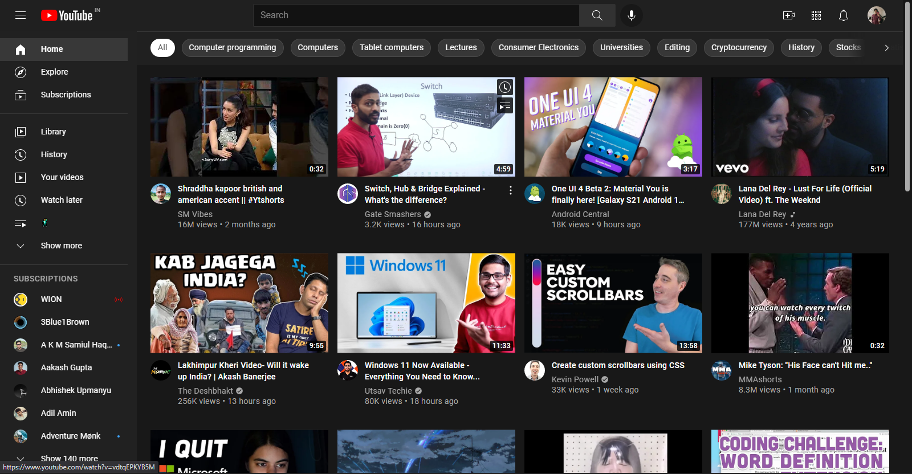
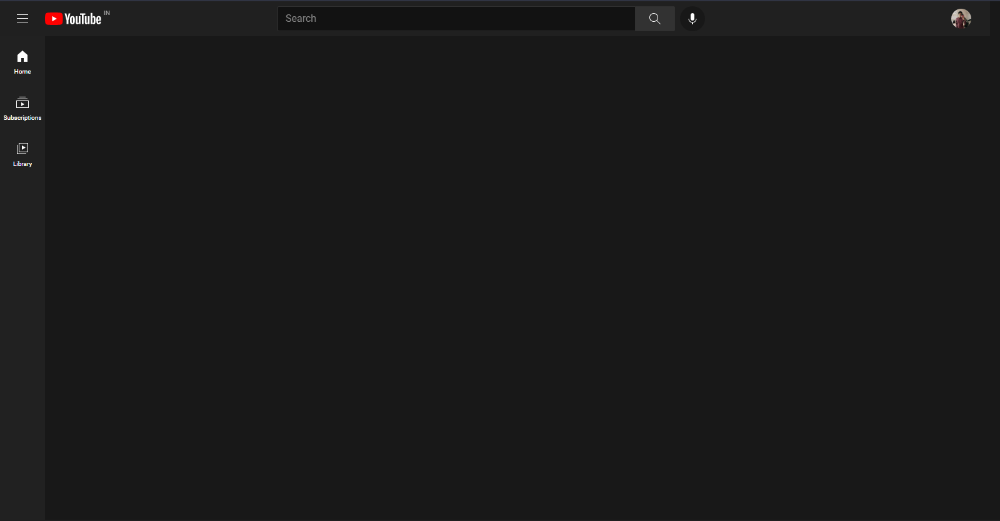
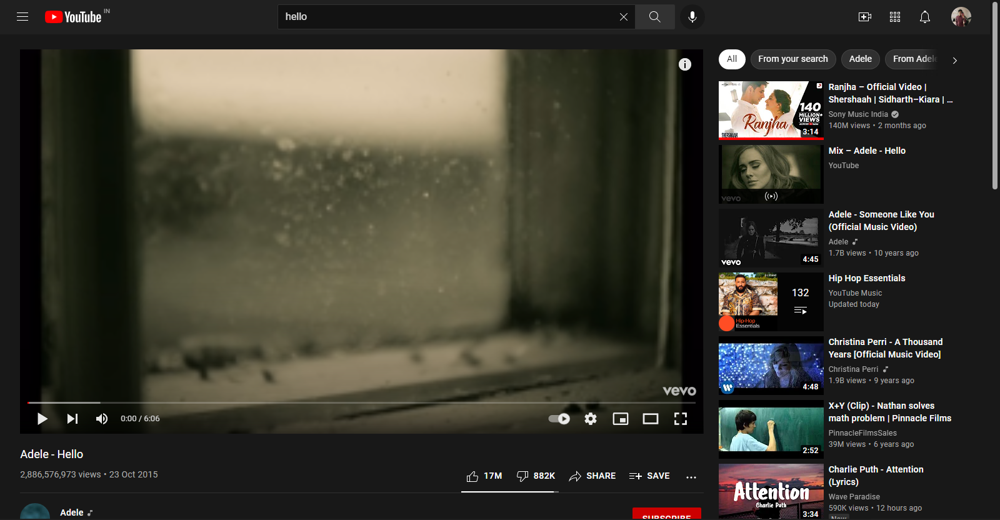
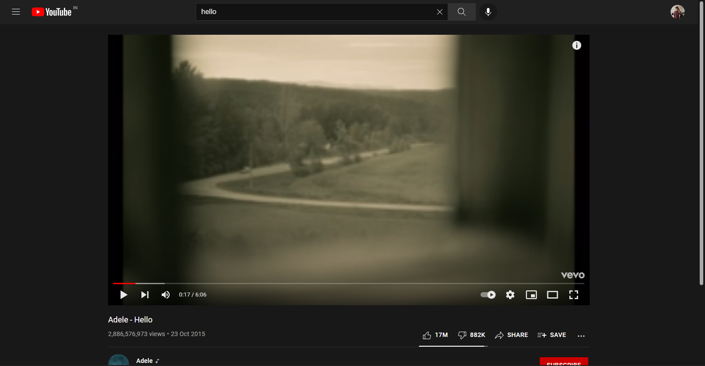

# Focus for YouTube

Rid Youtube of all Distractions. 

A chrome Extension that removes all the distractions from YouTube saving you from going into rabbit hole deviating from the research you were doing caused by recommendations and feed.

## Removes
1. *Recomendations*
2. *Similar videos*
3. *Home Feed*
4. *Explore*
5. *Creator shortcuts*

# Screenshots

## Before

## After

## Before

## After

## How to Install
 - Clone this Repository or download as zip
 - Open any chromium based Browser
 - navigate to chrome://extentions
 - Turn on Developer Mode
 - Load Unpacked -> select Focus folder of this repo you downloaded
 - Press ok and Voila!!

   
Feedback is welcome! Contact me for any info.  
Made with ❤ by Brijrajsinh parmar